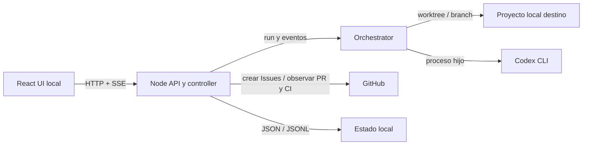

# AI Factory — arquitectura ligera y plan de mejora

**Estado:** decisión arquitectónica aceptada como base de implementación; cambios sujetos a revisión humana  
**Revisión original:** `damoklesh/ai-factory`, rama `master`, commit `4a82311136602e475b036c0f7d2b4d697d0675eb` (1 de octubre de 2026)  
**Línea base comprobada para implementación:** rama `main`, commit `99965f0034c5a50a705f02f3b353e0b8312e99ee` (1 de octubre de 2026)  
**Propósito:** orientar una siguiente iteración de Codex sobre el producto existente. No es una reescritura ni una especificación de arquitectura exhaustiva.

> La diferencia de rama/commit es deliberada y está registrada en
> `docs/architecture-gap-analysis.md`. La implementación se realiza sobre la
> línea base comprobada, sin ejecutar un orquestador procedente de una rama de
> historia y sin habilitar auto-merge.

## 1. Objetivo del producto

AI Factory permite que una persona seleccione un proyecto local, gestione su backlog de user stories y ordene desde una UI local que Codex implemente una o varias historias. El trabajo siempre se realiza en el repositorio de destino seleccionado, nunca accidentalmente en el repositorio de AI Factory.

La UI es el punto de entrada humano y de supervisión. El backend local valida el proyecto, sincroniza el backlog con GitHub, ejecuta el orquestador existente contra el proyecto destino y publica progreso, logs, resultados, bloqueos y solicitudes de decisión. No se añade una base de datos: los `.md` del backlog, Git/GitHub y ficheros JSON/JSONL cubren las necesidades iniciales.

### Principios

1. **Repositorio de control separado del proyecto destino.** AI Factory contiene UI, servidor y motor; Revenue Net Calculator (o cualquier otro proyecto) contiene el código que Codex modifica.
2. **UI como control plane local.** El usuario escoge el proyecto, sincroniza historias, inicia/para ejecuciones, decide bloqueos y revisa el resultado desde la UI.
3. **El backend, no el navegador, accede al sistema local.** Git, Codex CLI, ficheros, secretos y procesos hijos quedan en Node. La UI habla con el backend local.
4. **Backlog versionable, estado reconciliable.** `/backlog/*.md` es el contrato funcional editable y versionado. GitHub Issues reflejan esas historias y aportan colaboración y estado externo; no se crean Issues duplicadas.
5. **Cambios aislados y reversibles.** Cada historia se ejecuta en un worktree y rama dedicados. Merge automático desactivado por defecto; aprobación humana explícita.
6. **La tecnología del destino es desconocida hasta inspeccionarla.** No asumir TypeScript, JavaScript, `package.json`, ni un único sistema de build o test.
7. **Operabilidad visible.** Cada ejecución tiene identidad, estado duradero, eventos/logs consultables y un resultado terminal inequívoco.
8. **Probar el sistema antes de confiarle código.** Mock y repositorios temporales para las pruebas automatizadas; piloto real separado y deliberado.

## 2. Revisión del estado actual

El repositorio ya contiene piezas valiosas que deben reutilizarse:

| Área | Lo que existe | Observación para la siguiente iteración |
| --- | --- | --- |
| Monorepo | `automation/` TypeScript, `server/` Node, `ui/` React y `packages/contracts/` | Mantener el stack actual para AI Factory; no imponerlo a los proyectos que AI Factory desarrolla. |
| Motor CLI | Lee Issues, ordena prioridad/dependencias, crea worktree, invoca Developer/Reviewer de Codex, valida, crea PR y opcionalmente mergea | Es la base del ejecutor real. Debe recibir explícitamente un proyecto destino; hoy `repoRoot()` deriva el directorio desde `process.cwd()` y termina usando el checkout de AI Factory. |
| UI | Pestañas Overview, Backlog, Executions, Human validation y Configuration | Es buen punto de partida; hace falta agregar selección/configuración de proyecto y mostrar la ejecución real. |
| Servidor y contratos | API local, contratos compartidos, eventos SSE, sync de GitHub, edición de historia con revisión/conflicto | Ampliar los contratos para identificar proyecto, ejecución real, selección explícita de historia y eventos de proceso. |
| Historias locales | `server/src/stories.ts` lee `.md` desde `backlog/` y acepta frontmatter básico | La ruta por defecto apunta al contexto de AI Factory; debe resolverse con respecto al proyecto seleccionado. El parser actual es permisivo y solo reconoce un subconjunto de encabezados. |
| Persistencia | `server/src/persistence.ts` escribe snapshot JSON y eventos/decisiones/instrucciones JSONL debajo de `.agent/runs/` | Reutilizar el patrón; hacerlo por proyecto y fuera de la carpeta de trabajo del Codex, con recuperación, límites y retención documentados. |
| GitHub | `GitHubSyncAdapter.observe()` observa Issues/PR/checks relacionados y reconcilia los estados | El endpoint de sync actual **no publica historias locales como Issues**. Hace falta una operación de publicación idempotente, aparte de la reconciliación. |
| Control de ejecución web | `LocalController.start()` crea un snapshot `ACTIVE` y lo persiste | **No inicia el CLI ni un proceso Codex.** La UI puede mostrar una ejecución que no ha empezado. Es la brecha funcional prioritaria. |
| Logs | Hay eventos de controlador y lectura paginada de logs; el runner CLI actual captura stdout/stderr al final de la llamada | Conectar eventos de proceso en streaming, registrarlos en JSONL y mostrar progreso incremental. Evitar exponer razonamiento interno; mostrar eventos operativos, herramientas/etapas permitidas, comandos, resultados y errores. |
| Configuración | Configuración común en `automation/config.example.json` y config UI/API con owner/repo/branch | Separar `controlRepository` (AI Factory) de `targetProject` (ruta/repo/branch/backlog). No dejar que valores por defecto silenciosamente apunten a AI Factory. |
| Calidad | Hay tests de parser, Github, integración y tests server/UI; `npm test` tiene un alcance centrado en server/UI y el gap analysis detecta pruebas reales pendientes | Unificar un comando de validación; añadir unitarios, integración en repositorio temporal y E2E de navegador con Codex/GitHub simulados. |

Riesgos y discrepancias ya anotados en `docs/architecture-gap-analysis.md` que siguen siendo relevantes: `smokeCommands` se carga pero no se ejecuta; no está completa la reconciliación de estado/PR interrumpidos; existe `git add -A` sin revisión restrictiva del diff; la cancelación del árbol de procesos y el lock para dos controladores locales requieren protección. Los secretos deben seguir fuera de configuración, logs y commits.

### Diagnóstico sintético

No hace falta reemplazar lo existente. Hace falta cerrar el recorrido entre UI, proyecto elegido y motor que ya sabe crear worktrees/PRs. En particular, el UI/server controller y el ejecutor CLI aún son dos recorridos separados. Un run creado en la UI no debe llamarse `ACTIVE` como si Codex estuviera ejecutándose hasta que el backend haya lanzado y confirmado el proceso real.

## 3. Arquitectura objetivo

### Componentes

| Componente | Responsabilidad |
| --- | --- |
| **React UI** | Selección/estado del proyecto, backlog y Issues, lanzamiento de ejecución, flujo de aprobaciones, timeline y logs, configuración y estado de salud. Sin acceso directo a Git, tokens o disco arbitrario. |
| **Node local API/controller** | Valida rutas y solicitudes; carga configuración e historias del destino; invoca sincronización y motor; gestiona un solo proceso activo por proyecto; entrega snapshots/eventos; persiste estado/decisiones/logs. Escucha solo en loopback (`127.0.0.1`). |
| **Orchestrator service** | Coordina selección de historias, dependencias, worktrees, invocaciones Codex, validación, PR/checks/review y decisiones. Se reutiliza `automation/` detrás de una interfaz de ejecución que acepte un contexto explícito de proyecto y emita eventos. |
| **Codex CLI** | Proceso hijo iniciado por Node en el worktree de una historia. Su stdout/stderr y eventos JSON se leen incrementalmente; resultado estructurado validado por schema. |
| **Git local** | Fuente de commits y diffs; el código se cambia en branch/worktree del proyecto destino. AI Factory no se convierte en el checkout de destino. |
| **GitHub** | Mirror colaborativo del backlog como Issues y fuente de observaciones externas: PR, checks, reviews y merge. La sincronización local↔Issues se identifica por `storyId`. |
| **Almacenamiento local** | JSON/JSONL para proyectos recientes, configuración por proyecto, snapshots de run, eventos, decisiones e instrucciones. Sin base de datos en V1. |



### Selección del proyecto y límites del navegador

La API local corre en el mismo ordenador que el proyecto. El navegador no puede obtener una ruta física completa y permiso de acceso al directorio mediante un `<input type="file">` normal: en V1 la UI debe permitir **introducir/pegar una ruta** y el servidor validará, normalizará y guardará proyectos recientes. Un selector nativo de carpetas requiere más adelante empaquetar la UI como Electron/Tauri o añadir un helper de escritorio; no se debe simular que el navegador tiene esa capacidad.

Al seleccionar proyecto, el servidor debe mostrar ruta absoluta, repositorio remoto (si lo hay), rama base, backlog y diagnóstico. El usuario confirma el proyecto antes de permitir mutaciones.

- Si ya es repositorio Git, comprobar raíz, estado de cambios, rama actual, remoto(s) y acceso de escritura. Nunca reemplazar remotos ni cambiar branch sin consentimiento.
- Si no es repositorio Git, permitir `git init` solo con confirmación explícita, indicando exactamente la carpeta afectada. Si se desean Issues/PR, pedir un remoto GitHub existente o pausar esa capacidad hasta configurarlo.
- Si la carpeta contiene trabajo local sin commitear, no pisarlo: informar y exigir una elección segura (dejarlo intacto y usar worktree desde un commit confirmado, o cancelar/limpiar manualmente). AI Factory no hará stash/reset/clean implícitos.
- Si no existe `/backlog`, ofrecer crearlo y generar una plantilla inicial. No convertir la carpeta destino en proyecto JS por defecto.
- Rechazar rutas inválidas, archivos en lugar de carpetas, el directorio de AI Factory como destino (salvo override avanzado explícito) y rutas fuera de las permitidas según política local configurada.

### Modelo de ejecución

1. Usuario escoge proyecto existente o añade una ruta local; ejecuta diagnóstico.
2. Controller resuelve raíz Git, branch base, idioma/stack detectable, backlog y conexión GitHub; no modifica contenido al diagnosticar.
3. Usuario puede crear scaffold inicial, crear/editar `.md` o importar un backlog existente; revisa y sincroniza historias con Issues.
4. Usuario elige una historia explícita o `Auto`. La ejecución tiene máximo de historias configurable (por defecto 1), con auto-merge apagado.
5. Controller reserva lock por proyecto, valida que no haya otro run vivo, configura directorio de trabajo y crea/recupera worktree y branch estables.
6. Orquestador emite `run.started`, fase y eventos de proceso; Node persiste cada evento y lo envía por SSE. UI puede recuperar estado/logs por API si pierde la conexión.
7. Codex trabaja en el worktree del proyecto destino. El motor ejecuta las validaciones detectadas/configuradas, revisa diff, genera PR si corresponde y espera checks/decisión.
8. Si falta decisión/credencial/contexto, el estado cambia a `BLOCKED`/`NEEDS_HUMAN` con motivo accionable. La persona puede aprobar/rechazar/deferir, editar la historia con previsualización de diff o añadir instrucción acotada para la próxima invocación.
9. Run termina como `SUCCEEDED`, `FAILED`, `BLOCKED`, `CANCELLED` o `INTERRUPTED`. UI informa historia, commit/PR/sha, validaciones y siguiente acción.
10. Al reiniciar servidor/UI, se recuperan snapshots. Cualquier proceso cuya vida no pueda verificarse queda `INTERRUPTED` hasta reconciliar, nunca falso `ACTIVE`.

### Contrato de proyecto, estado y configuración

Configuración por proyecto (ejemplo conceptual; no obliga a persistir este JSON exacto):

```json
{
  "projectId": "hash-of-canonical-project-path",
  "targetPath": "C:/work/revenue-net-calculator",
  "github": { "owner": "example", "repo": "revenue-net-calculator" },
  "baseBranch": "main",
  "backlogPath": "backlog",
  "validationCommands": [],
  "autoMerge": false,
  "maxStoriesPerRun": 1
}
```

Los tokens permanecen en variable de entorno/gestor de credenciales existente, nunca en este JSON, en contratos de UI, en argumentos visibles, en prompts de diagnóstico ni en logs. El nombre `runnerLabel: "ai-local"` pertenece al runner de GitHub Actions existente; no identifica ni crea por sí mismo un runner de Codex local. En modo UI-first, Node inicia Codex localmente. El workflow de Actions se conserva para CI/pruebas o como modo remoto opcional, pero no se mantiene como segundo controlador simultáneo del mismo repositorio sin lock/reconciliación.

Almacenamiento local por proyecto, separado del worktree del agente, por ejemplo `.agent/projects/<projectId>/` dentro del checkout AI Factory (ignorado por Git), con `project.json`, `runs/<runId>/snapshot.json`, `events.jsonl`, `decisions.jsonl` e `instructions.jsonl`. Para varias instalaciones o datos grandes se puede mover a un directorio de datos de usuario; mantener el contrato y evitar guardarlo dentro del repositorio destino. Aplicar redacción de secretos, límites/retención y escritura atómica de snapshots.

## 4. Backlog como Markdown y sincronización a GitHub

### Fuente canónica y sincronización

- Los ficheros versionados `backlog/US-###-short-name.md` del **proyecto destino** son la especificación canónica de historia, su prioridad, dependencias, alcance y criterios de aceptación.
- GitHub Issue es un espejo de colaboración; se enlaza de forma estable mediante `storyId` y `githubIssueNumber` en metadatos del story o un índice local JSON. No se debe usar el número de Issue como ID funcional ni reescribir dependencias si cambia el número.
- Botón **Sync backlog to GitHub** crea Issue faltante y actualiza título/cuerpo/labels de Issue existente cuando el `.md` cambió. Debe presentar preview (nuevas, actualizaciones, conflictos) y pedir confirmación antes de publicar. Nunca crear una Issue por cada sync repetido.
- Botón **Refresh GitHub state** es distinto: consulta Issues, PRs, CI/reviews/merge y reconcilia el estado externo. Una divergencia de contenido no se resuelve silenciosamente con last-write-wins: mostrar diff y pedir elección.
- Identificar Issue con marcador estable y parseable en el cuerpo, por ejemplo `<!-- ai-factory:story-id=US-001 -->`; añadir label `agent:ready` solo con decisión del usuario o regla acordada. `agent:running`, `agent:blocked` y `agent:done` reflejan etapas del proceso, no sustituyen el snapshot local.

### Formato estándar de user story (inglés)

Cada fichero UTF-8 usa este formato estricto. `priority` es entero positivo (1 es más alta); `dependencies` lista IDs locales separados por comas o `none`. IDs son únicos en el backlog. Se valida todo el documento antes de sincronizar o ejecutar.

```markdown
---
storyId: US-001
title: Create the initial project scaffold
priority: 1
dependencies: none
labels: agent:ready
---

# US-001 — Create the initial project scaffold

## User Story
As a project owner, I want the repository to have a documented, technology-appropriate baseline so that future stories can be implemented and validated safely.

## Context
Describe the repository, existing constraints, and relevant references.

## Scope
- In scope: ...
- Out of scope: ...

## Acceptance Criteria
- [ ] AC-1: ...
- [ ] AC-2: ...

## Technical Notes
- Preserve the existing stack and conventions where present.
- Do not introduce a JavaScript package manifest unless JavaScript/TypeScript is selected for this target.

## Validation
- [ ] Run the repository's documented build/test/lint commands.
- [ ] Report commands that could not be run and why.

## Human Decisions
- List decisions that must be approved before implementation; write `None` otherwise.
```

Validation rules: require `storyId`, `title`, `priority`, the `User Story`, `Scope`, at least one uniquely numbered `AC-*`, and `Validation`. IDs/dependency references must resolve, with no cycles. Optional sections may be empty but must remain present in the generated template. Treat unknown frontmatter keys as warnings in V1; malformed required values or duplicate IDs block sync/start and explain the file/line. The parser should support the chosen headings exactly and have fixture tests; stop accepting arbitrary Spanish/English variants as silent aliases once this standard is adopted (a migration warning may be provided).

### Selección de historia

- `Run selected story`: solo permite historias válidas y ejecutables; muestra dependencias y razón si bloqueada.
- `Run next eligible story`: historias abiertas y no completadas; dependencias solo se satisfacen cuando su historia quedó `MERGED`/completada según política; prioridad ascendente, empate por ID estable (y luego nombre de fichero). Si no hay historia elegible, mostrar por qué, no ejecutar otra.
- Nunca iniciar dos ejecuciones para el mismo proyecto simultáneamente. El usuario puede escoger ejecutar una historia aunque no sea la siguiente elegible solo cuando dependencias están cumplidas; override no permite saltar dependencias.
- Estado externo de Issue no equivale automáticamente a entrega completada. `MERGED` solo si el PR ligado a HEAD actual aparece como merged. `DONE`/`agent:done` no se emite antes de verificar commit/PR/merge requerido.

## 5. UX: pestañas y comportamiento

| Pestaña | Contenido esperado |
| --- | --- |
| **Project / Overview** | Proyecto destino activo, ruta, branch, remoto, conexión GitHub/Codex, health checks, conteos backlog, run activo y última ejecución. Acciones: cambiar proyecto, diagnóstico, refresh Github, abrir configuración. No incluir secretos. |
| **Backlog** | Lista de historias por prioridad/estado; selección múltiple solo para sync; detalle con user story, criterios, dependencias, prioridad, Issue/PR/commit links y diferencias local/remoto. Acciones: editar con preview, sync Issue, refresh estado, Run selected, Run next eligible. Estados distintos: local, sync pendiente, conflict, ready, blocked, active, validation failed, PR open, merged. |
| **Executions** | Historial y detalle del run activo: historia, selección manual/auto, fase/timeline con marcas de tiempo, actividad reciente, comandos y salida permitida, archivos/diff resumido, validaciones, commit, PR y checks. Filtros/niveles de log; recarga paginada. Start debe devolver `runId` solo cuando la tarea quedó aceptada; mostrar fase de arranque si no se lanzó aún. |
| **Human validation** | Bandeja de bloqueos/aprobaciones con motivo, evidencia, revisión del spec y SHA esperado. Approve/reject/defer con razón donde aplique; añadir instrucción para próxima invocación; enlace a editar spec (preview primero). Aprobación de merge ligada al mismo SHA y spec revision que se revisaron; invalidar si cambian. |
| **Configuration** | Proyecto, GitHub `owner/repo`, branch base, ruta backlog, selección/ejecución, modelo/timeout, comandos de validación, checks y política de merge. Muestra procedencia de cada parámetro, validación, diff de cambios, guardar/cancelar. Tokens fuera del formulario salvo estado configurado/no configurado. |

### Logs y visibilidad

La UI debe hacer evidente: **qué está ocurriendo**, **desde cuándo**, **qué está esperando**, **qué falló** y **qué acción puede hacer la persona**. Usar una línea de tiempo de fases (setup, selecting, worktree, codex, validation, review, PR/checks, human gate, complete) más salida reciente. Guardar eventos JSONL con `runId`, `sequence`, `timestamp`, `source`, `phase`, `level`, `message` y metadatos seguros. Codex `--json` se consume línea a línea; actualizar snapshot, append JSONL y enviar SSE. Si SSE se desconecta, el navegador hace backfill por cursor.

No prometer mostrar todo el “pensamiento” de Codex. Mostrar estados y operaciones observables, comandos/validaciones y salida del proceso según política. Sanitizar tokens/headers/URLs sensibles, limitar tamaño por evento, paginar logs y capturar código de salida. Eventos terminales (`run.succeeded`, `run.failed`, `run.blocked`, `run.cancelled`, `run.interrupted`) disparan aviso visible con resumen y siguiente acción. Timeout o proceso muerto no puede quedar indefinidamente como trabajando.

## 6. Scaffolding agnóstico al lenguaje

El onboarding de un proyecto nuevo es un paso explícito antes de pedir implementación funcional. El doctor inspecciona ficheros de build/manifiestos, README, lockfiles, workflows CI, estructura y tests existentes. Produce un resumen del stack/commands detectados y permite que la persona confirme/corrija. La primera historia de scaffold debe:

- Preservar tecnología, licencias, estructura y convenciones presentes; si vacío, preguntar o proponer opciones sin escribir hasta confirmación.
- Crear solo documentos mínimos convenidos: `README.md` actualizado, `AGENTS.md` con reglas del repo, `docs/PROJECT_OVERVIEW.md` (propósito/arquitectura), `docs/DEVELOPMENT.md` (setup/build/test) y backlog/template si faltan. Adecuar nombres/cantidad para no duplicar documentos existentes.
- Crear skeleton de aplicación/test específico a la tecnología confirmada, no antes. `package.json` solo si el proyecto es Node/JS/TS y realmente lo requiere. Mantener lockfiles/manifiestos coherentes si se agregan dependencias.
- Definir detección/comandos de validación a partir de CI/manifiestos; no inventar `npm test`. Si no se detectan, proponer comandos para aprobación; ejecutarlos en entorno seguro con timeout.
- Dejar cambios en branch/worktree, pasar validaciones detectadas y devolver resumen del scaffold y documentación creada.

La historia de scaffold es única para el destino sin documentación mínima; el usuario puede editarla. No asumir que el orquestador genera todos los documentos con una única instrucción implícita.

## 7. Calidad y estrategia de pruebas

Conservar el runner de pruebas existente si no hay motivo para cambiarlo; lo importante es que `npm test` incluya pruebas deterministas, informativas y ejecutables en CI. Pruebas del AI Factory no deben usar credenciales reales ni escribir en repositorios del usuario.

| Nivel | Qué valida | Técnica/fixtures sugeridos |
| --- | --- | --- |
| Unitarios | Parser/frontmatter; dependencias, prioridad y desempate; estados y transiciones; lógica de sync/idempotencia; redacción de secretos; configuración/rutas; adaptación de eventos Codex | `node:test` existente o runner ya instalado; fixtures de Markdown/JSON. Sin red/Git/Codex real. |
| Integración | API Node ↔ controller ↔ persistencia; creación/recuperación/cancelación de run; stream de proceso; Git init/branch/worktree/diff en repos temporales; recuperación de fallos parciales; GitHub adapter con servidor stub | `node:test`, directorio temporal por prueba, fake runner y fake GitHub HTTP. Limpiar solo el directorio temporal creado por la prueba. |
| End-to-end | Camino UI: seleccionar carpeta/proyecto, doctor, cargar backlog, sincronizar mock Issues, iniciar historia, ver progreso/logs, aprobar/editar/instruir, ver resultado y recuperar tras refresh | Playwright sobre server/UI locales y fake Codex/GitHub; no llamar servicios reales por defecto. Capturar consola, errores y screenshots en fallo. |
| Piloto manual | De dos historias pequeñas en un repositorio GitHub privado descartable, con CI y runner/Codex configurados | Runbook con precondiciones, cleanup, evidencia de PR/checks y rollback. Nunca parte del test automático de cada PR. |

Casos críticos: historia inválida, ID duplicado, ciclo/dependencia ausente; Git ausente y `git init` cancelado/confirmado; destino con cambios sin commitear; error al abrir remote; botón repetido/doble click; dos inicios concurrentes; Codex tarda, falla, quota/auth, emite salida inválida o proceso hijo queda colgado; backend reinicia durante run; SSE reconecta sin duplicados; evento parcialmente escrito; instrucción humana atada a ejecución obsoleta; aprobación con spec/HEAD cambiado; CI pendiente/fallido; sync repetido no crea duplicados; no capturar secretos; auto-merge desactivado.

La cobertura porcentual puede mantenerse inicialmente en el umbral existente mientras se protege primero cada regla crítica. El criterio de salida no es solo el porcentaje: debe estar verde el comando completo, cobertura de ramas de estados críticos y pruebas E2E de humo en CI.

## 8. Seguridad y operación local

- Escuchar solo en `127.0.0.1`; mantener comprobación de `Origin`/CSRF para endpoints mutantes, límite de tamaño y validación de schema.
- Solo backend puede crear procesos y ejecutar Git. Usar argumentos de proceso separados (no interpolar entrada del usuario en shell), timeout, lock por proyecto y terminación de proceso/grupo.
- Normalizar paths, resolver symlinks cuando se permita, evitar path traversal, verificar que las carpetas de trabajo derivan de un target aprobado y que el worktree esté bajo directorio controlado.
- Confirmación explícita para `git init`, publicación de Issues, cambio de remote, cambios de configuración sensible, push, merge/auto-merge y operaciones destructivas. No ejecutar `reset --hard`, `clean`, stash/pop o sobreescritura tácita.
- Revisar diff antes de commit/push. Reemplazar `git add -A` sin inspección por estrategia de cambios permitidos y denegados; excluir secretos, archivos temporales y cambios del agente fuera del scope. No incluir `AGENTS.md`/config/control policy a menos que la historia lo autorice.
- Mantener `autoMerge=false` por defecto y comparar SHA de PR contra SHA validado/aceptado inmediatamente antes de mergear.
- Separar datos operacionales de worktree/Git; logs con redacción, rotación/retención y opción de borrar por proyecto; nunca persistir prompts que contengan secretos.
- Al iniciar UI, mostrar diagnóstico claro de `codex`, `git`, token y permisos. El `runnerLabel` de Actions no instala un runner; la configuración local debe comprobar ejecutables y login de Codex por separado.

## 9. Plan de implementación

Secuencia recomendada, con una historia pequeña por ejecución al principio:

1. **Estabilizar contrato y pruebas básicas:** formato de historia, estados, selección, mocks comunes y comando de CI completo.
2. **Project workspace:** ruta local destino, doctor, asociación repo/GitHub, `git init` confirmado, backlog en destino y estado separado por proyecto.
3. **Backlog ↔ GitHub:** preview, publicación idempotente de Issues y reconciliación diferenciadas.
4. **Conectar UI al runner real:** controller invoca el motor con `targetPath`; ejecución serializada, worktree y lifecycle real.
5. **Observabilidad:** eventos de proceso en streaming, logs duraderos y recovery/reconexión UI.
6. **Control humano y seguridad:** decisiones stale-safe, instrucciones, edición de spec con preview, cancelación, diff policy/lock.
7. **Scaffold y E2E:** onboarding agnóstico, comandos detectados y pruebas de navegador completas; piloto controlado GitHub al final.

No ejecutar dos implementaciones en paralelo (UI controller y Actions workflow) para un mismo target hasta que compartan lock, estado y reconciliación confiables. En primera entrega, local UI es el único lanzador de ejecución; Actions conserva CI del propio AI Factory y workflow legacy documentado, pero no se usa como control plane diario.

### Criterios de terminado de la iniciativa

- Desde UI se selecciona un proyecto que no sea AI Factory, se diagnostica y se identifica exactamente qué repo será cambiado.
- Se inicializa Git solo tras consentimiento o se usa el Git existente sin alterar trabajo local del usuario.
- Se parsea backlog estándar; sync repetido no duplica Issues; dependencia/prioridad dan orden reproducible.
- Inicio crea un run real y visible que ejecuta Codex dentro del worktree del destino; detener/reanudar/recovery no falsean el estado.
- Logs progresan en UI y sobreviven refresh/reinicio; resultado terminal muestra validaciones, diff/commit/PR y siguiente acción.
- Aprobación/edición/instrucción humana es trazable, idempotente y rechazada si el SHA/spec revision quedó obsoleto.
- Unit/integration/E2E deterministas verdes sin tokens/servicios reales y piloto manual documentado.
- Proyecto destino puede ser de cualquier lenguaje; documentación y scaffolding reflejan tecnología detectada y no inventan `package.json`.

## 10. User stories de implementación

Las siguientes historias forman el backlog sugerido para integrar en `backlog/` una vez revisadas. El contenido está en inglés para fijar el contrato estándar. Las prioridades son relativas: P1 desbloquea el flujo completo; historias con dependencias no comienzan antes de cumplirlas.

### US-001 — Standardize and validate backlog stories

**Priority:** 1  
**Dependencies:** none

**User Story**  
As a project owner, I want a strict, documented user-story format so that local Markdown, GitHub Issues, selection, and Codex prompts interpret the same requirements.

**Scope**
- Document and implement the Markdown/frontmatter contract defined in section 4.
- Validate required sections, stable story IDs, priority, dependencies, acceptance criteria, and validation tasks.
- Provide a template and actionable errors including file and line; detect duplicate IDs, missing dependencies, and cycles.
- Support a warning/migration path for existing backlog stories using older headings.

**Acceptance Criteria**
- [ ] AC-1: A valid fixture parses into a normalized story model with stable `storyId`, priority, dependency IDs, acceptance criteria, and revision hash.
- [ ] AC-2: Missing required fields, duplicate IDs, invalid priority, unresolved dependencies, and cycles block sync and run start with actionable diagnostics.
- [ ] AC-3: Parsing is deterministic and independent of filesystem enumeration order.
- [ ] AC-4: Template is available to the UI and documented for a human author.
- [ ] AC-5: Existing Spanish/legacy headings are either migrated or reported as deprecated; they are not silently misinterpreted.

**Tests**
- Unit: parser fixtures for valid/minimal/malformed/legacy Markdown, dependency graph, duplicate ID, stable hash.
- Integration: load a temporary `backlog/` with mixed valid/invalid files and assert diagnostics.
- E2E: backlog view displays validation error and prevents start for invalid story.

### US-002 — Select and validate a local target project

**Priority:** 1  
**Dependencies:** US-001

**User Story**  
As a user, I want to choose a local project directory independently from the AI Factory repository so that every generated change is applied to the repository I intend.

**Scope**
- Add target path entry and recent-project selection to the UI; backend validates/canonicalizes it and displays root, branch, remote, backlog, and diagnostic results.
- Detect existing Git repo or offer explicit `git init`; ask for a GitHub remote association if Issue/PR functions are wanted.
- Keep per-target configuration and operational state separate from AI Factory and target worktree.
- Do not silently mutate dirty/untracked user files; never default target to AI Factory.

**Acceptance Criteria**
- [ ] AC-1: The UI can add, switch, and re-open a valid target path; the server rejects nonexistent paths and non-directory paths with a clear reason.
- [ ] AC-2: Repository root is resolved correctly when the path is a subdirectory of a Git repo.
- [ ] AC-3: A non-Git directory only receives `git init` after explicit confirmation naming the exact path; cancel leaves it unchanged.
- [ ] AC-4: Existing remotes, current branch, base branch, and dirty state are shown before run; no destructive Git operation occurs implicitly.
- [ ] AC-5: AI Factory root is rejected as target in normal mode and has no effect on existing user files.
- [ ] AC-6: Backlog is resolved under the target project, not the controller repository.

**Tests**
- Unit: path validation, root resolution, project ID canonicalization, policy checks.
- Integration: temp dirs for Git repo, nested folder, non-Git folder, invalid path, dirty worktree; stub `git init` confirmation.
- E2E: enter Revenue Net Calculator path, inspect diagnostics, cancel/confirm init.

### US-003 — Preview and synchronize stories to GitHub Issues

**Priority:** 1  
**Dependencies:** US-001, US-002

**User Story**  
As a user, I want to publish my local Markdown stories as GitHub Issues and refresh their external state without creating duplicates or losing local edits.

**Scope**
- Separate `Sync backlog to GitHub` from `Refresh GitHub state`.
- Create/update Issue body/title/labels via stable story ID; persist Issue mapping in target backlog metadata or a versioned local index.
- Preview operations and conflicts before writing; honor least-privilege token configuration.
- Reconcile PR/check/review/merge observations and bind validation to exact HEAD SHA.

**Acceptance Criteria**
- [ ] AC-1: Preview lists Issues to create, update, unchanged, and conflict, keyed by `storyId`.
- [ ] AC-2: Repeating a confirmed sync is idempotent; it never creates a second Issue for the same story.
- [ ] AC-3: A stable marker maps remote Issue to local story even if title changes or Issue number changes in a local fixture.
- [ ] AC-4: Divergent local and Issue content is shown as a conflict and is not overwritten without a human choice.
- [ ] AC-5: Refresh updates Issue/PR/check/merge observations and exposes stale/failed connectivity without losing last known values.
- [ ] AC-6: Token is never returned to UI, written to logs, or stored in target JSON.

**Tests**
- Unit: Issue body mapping, marker parsing, conflict rules, sync diff, idempotency.
- Integration: fake GitHub API for create/update/rate limit/permission/partial failure; no network in default test.
- E2E: preview, confirm publish, repeat sync, verify one Issue and visible PR/check state.

### US-004 — Run a selected or automatically selected story in the target repository

**Priority:** 1  
**Dependencies:** US-001, US-002, US-003

**User Story**  
As a user, I want the UI to launch the real orchestrator for one selected story or the next eligible story so that Codex works only in the intended target project.

**Scope**
- Replace the current snapshot-only `LocalController.start()` behavior with a real execution service around the existing CLI/orchestrator.
- Pass explicit project root, GitHub repo, backlog, branch, selection mode, story ID, config revision, and run ID; stop resolving target repo from `process.cwd()`.
- Use one controller lock per target, stable branches, isolated worktrees, configured `maxStories` (default 1), `autoMerge=false`.
- Auto selection: eligible, open, not completed, dependencies merged; sort by priority ascending, then stable story ID.
- Ensure commit/push path inspects diff and excludes policy/config/secrets/unrelated files before staging.

**Acceptance Criteria**
- [ ] AC-1: Start returns a durable run ID and transitions to `ACTIVE` only after the process is spawned successfully; spawn/config failure is terminal and visible.
- [ ] AC-2: Selected story runs only if valid and dependencies are satisfied; auto mode chooses the documented deterministic next story.
- [ ] AC-3: Codex working directory is the target story worktree, never the AI Factory checkout or target's shared main working tree.
- [ ] AC-4: A second run for the same target is rejected safely; runs for different targets follow documented concurrency policy.
- [ ] AC-5: Existing branches/PRs are reconciled on retry; no duplicate branch/PR is created for the same story/run policy.
- [ ] AC-6: Default flow stops before merge; a commit/push requires a reviewed diff and correct target remote.

**Tests**
- Unit: explicit and automatic selection, ordering, active/completed/dependency rules.
- Integration: temp Git repo with fake Codex; assert worktree path, branch, diff policy, lock, repeated start and recovery.
- E2E: choose a story, click Run, assert actual fake process events appear and terminal result matches process outcome.

### US-005 — Stream and persist execution progress and logs

**Priority:** 1  
**Dependencies:** US-004

**User Story**  
As a user, I want to see meaningful live progress and recoverable logs so that I know whether Codex is working, blocked, or finished.

**Scope**
- Read Codex JSON/stdout/stderr incrementally; adapt to normalized run events with ordered sequence IDs.
- Persist snapshot and JSONL events per target/run; publish SSE; support cursor-based backfill and paginated log view.
- Present phase timeline, timestamp, latest activity, commands/checks, errors, exit status, result summary, and next action. Do not present private chain-of-thought as a product feature.
- Redact secret patterns, cap event/log size, rotate/expire old logs, recover orphaned process/run states.

**Acceptance Criteria**
- [ ] AC-1: UI displays an event while fake Codex is still running, without waiting for process completion.
- [ ] AC-2: Refresh/reconnect replays missing events exactly once in sequence and shows the current snapshot.
- [ ] AC-3: Success, error, timeout, auth/quota, cancellation, and process crash each end in a visible terminal or blocked state with an actionable message.
- [ ] AC-4: Logs persist after server restart; an unverifiable old `ACTIVE` run becomes `INTERRUPTED` pending reconciliation.
- [ ] AC-5: Tests prove configured token fixtures are redacted and output size/retention limits work.
- [ ] AC-6: UI distinguishes “waiting for input/check” from “process running”.

**Tests**
- Unit: event normalization, sequence/cursor, redaction, terminal transitions.
- Integration: fake streaming child process, truncation/corrupt final JSONL line, restart recovery, SSE disconnect/backfill.
- E2E: observe progress, disconnect/reload, view full run log, confirm terminal status.

### US-006 — Support human decisions, spec edits, and follow-up instructions

**Priority:** 2  
**Dependencies:** US-004, US-005

**User Story**  
As a user, I want to resolve a blocked run with an explicit decision, a reviewed story change, or a focused new instruction so that ambiguous work resumes safely.

**Scope**
- Retain Human validation tab and current approval/decision/instruction/spec-edit contracts; connect them to the real orchestrator safe points.
- Display evidence, block reason, target/run/story, spec revision, PR HEAD SHA and requested action.
- Approve/reject/defer with reason where needed; optionally edit Markdown by previewing a diff; queue follow-up instruction for next Codex invocation.
- Record decisions/instructions idempotently and invalidate stale approvals/instructions when run/spec/HEAD changes.

**Acceptance Criteria**
- [ ] AC-1: A blocked run shows a concrete reason, relevant evidence/log link, and allowed user actions.
- [ ] AC-2: Approve/reject/defer produces a durable audit event and is idempotent for the same request key.
- [ ] AC-3: Merge approval checks both expected SHA and spec revision immediately before merge; changed SHA/revision requires new review.
- [ ] AC-4: Editing a story shows diff first; active story cannot be edited until safe pause; save updates local file and invalidates old validation.
- [ ] AC-5: New instruction is attached to a specific story/run and only applied on an explicitly logged next invocation.
- [ ] AC-6: Existing Overview/Backlog/Executions/Human validation/Configuration tabs retain distinct documented purposes.

**Tests**
- Unit: state gates, idempotency, stale SHA/revision, rejection/defer reason.
- Integration: decision/instruction JSONL persistence, resume after approval, pause and spec edit, failed merge check.
- E2E: blocked path → human instruction or approval → resumed execution; stale approval rejected visibly.

### US-007 — Add technology-aware project doctor and scaffold story

**Priority:** 2  
**Dependencies:** US-001, US-002, US-004

**User Story**  
As a project owner, I want AI Factory to inspect and scaffold a new or undocumented repository according to its actual technology so that future work has clear setup, architecture, and validation instructions.

**Scope**
- Detect likely language/build/test tool from repository files and CI; show evidence/confidence and request user confirmation if ambiguous.
- Use a dedicated editable scaffold story/prompt to create or update minimum project docs and a technology-appropriate skeleton.
- Never assume Node/TypeScript or create `package.json` unless chosen stack calls for it; don't duplicate existing documentation or replace manifests/lockfiles arbitrarily.
- Discover validation commands from CI/manifests; propose missing commands rather than inventing silent defaults.

**Acceptance Criteria**
- [ ] AC-1: Doctor reports detected stack/tools and files used as evidence, or reports unknown without mutating the project.
- [ ] AC-2: User confirms/corrects stack before scaffolding when detection is ambiguous or project is empty.
- [ ] AC-3: Scaffold produces/upgrades agreed README, AGENTS and concise project/development docs without duplicate conflicting files.
- [ ] AC-4: Technology-specific manifests/tests are generated only for the confirmed stack; an empty Java/Python/.NET fixture does not receive `package.json`.
- [ ] AC-5: Scaffold runs documented validations and reports skipped/unavailable commands.
- [ ] AC-6: Scaffold changes are isolated, diff-reviewed, cancellable and reversible via normal Git workflow.

**Tests**
- Unit: detector fixtures for Node, Java, Python, .NET, Go, mixed, unknown; command discovery.
- Integration: run scaffold prompt against fake Codex for Java and Python temporary repos, validate no unrelated package artifacts.
- E2E: doctor → confirm stack → run scaffold → inspect docs and test output.

### US-008 — Make test automation deterministic and comprehensive

**Priority:** 1  
**Dependencies:** US-001, US-002, US-003, US-004, US-005

**User Story**  
As a maintainer, I want reliable unit, integration, and end-to-end tests for AI Factory so that regressions are caught before users run Codex against their projects.

**Scope**
- Create a single documented local/CI test entry point for build, lint/type checks, unit, integration and UI E2E.
- Add fake GitHub/Codex/process adapters and temp-repository fixtures; real services are opt-in pilot only.
- Add Playwright E2E smoke path, CI browser dependency setup and diagnostic artifacts on failure.
- Eliminate ignored/unimplemented config behavior or clearly remove/deprecate it; test `smokeCommands`, cancellation, lock, recovery, SHA and secret handling.

**Acceptance Criteria**
- [ ] AC-1: Clean checkout can install and run the complete deterministic test suite using documented commands on supported developer/CI environment.
- [ ] AC-2: Default tests make no network requests, do not require credentials/Codex login, and never mutate a user repository.
- [ ] AC-3: Unit, integration, and E2E results are separately visible in local output/CI.
- [ ] AC-4: Critical recovery/concurrency/secret/diff/SHA cases from section 7 are covered.
- [ ] AC-5: Failed E2E test preserves useful browser/server logs and screenshot/trace without secrets.
- [ ] AC-6: CI fails on type/build/test errors; smoke setting either executes as documented or is removed from supported config.

**Tests**
- This story is itself the test suite; add a deliberately failing fixture in a local test to prove failure is surfaced, then remove it before merge.
- Integration: run suite twice to detect order-dependent state or leaked temp directories.
- E2E: execute primary happy path and blocked/error path in CI with fake adapters.

### US-009 — Harden cancellation, locking, startup recovery, and runbooks

**Priority:** 2  
**Dependencies:** US-004, US-005, US-008

**User Story**  
As a user, I want runs to stop and recover predictably after duplicate clicks, process failures, or server restart so that neither the UI nor GitHub reports misleading state.

**Scope**
- Per-target atomic lock with owner/run metadata, safe stale-lock recovery and clear user remediation.
- Process-group cancellation with timeout and child cleanup; no shell-string interpolation.
- Reconcile branch/worktree/PR/check state at startup and before resume; make transitions explicit through verifying/merged/blocked/failed/interrupted.
- Add setup, troubleshooting, pilot, recovery and cleanup runbooks for Windows/WSL/Linux as applicable.

**Acceptance Criteria**
- [ ] AC-1: Two concurrent starts for the same target cannot write/push simultaneously; second request gets a clear conflict response.
- [ ] AC-2: Stop/timeout terminates the spawned process tree and records terminal status/log reason.
- [ ] AC-3: Restart recovers snapshots and safely reconciles live/stale runs without duplicate PRs or marking work done early.
- [ ] AC-4: Stale lock recovery requires PID/host/age checks and does not delete a lock owned by a live process.
- [ ] AC-5: Runbooks explain installations/prerequisites, `ai-local` Actions runner versus local Codex, commands, env token setup, known limitations, pilot, recovery, cleanup.

**Tests**
- Unit: lock lifecycle/stale owner checks and explicit state transition table.
- Integration: child process with grandchild; kill/cancel/timeout; server restart with incomplete run; stale PR HEAD.
- E2E: duplicate start, stop, refresh/reopen and recovery banner.

## 11. Repository-level implementation references

Files reviewed for this proposal:

- [`README.md`](https://github.com/damoklesh/ai-factory/blob/4a82311136602e475b036c0f7d2b4d697d0675eb/README.md) — startup, workflow and current product description.
- [`AI_Factory_V1_Plan.md`](https://github.com/damoklesh/ai-factory/blob/4a82311136602e475b036c0f7d2b4d697d0675eb/AI_Factory_V1_Plan.md) — baseline design and original assumptions.
- [`docs/architecture-gap-analysis.md`](https://github.com/damoklesh/ai-factory/blob/4a82311136602e475b036c0f7d2b4d697d0675eb/docs/architecture-gap-analysis.md) — known gaps from prior audit.
- [`server/src/controller.ts`](https://github.com/damoklesh/ai-factory/blob/4a82311136602e475b036c0f7d2b4d697d0675eb/server/src/controller.ts) and [`server/src/persistence.ts`](https://github.com/damoklesh/ai-factory/blob/4a82311136602e475b036c0f7d2b4d697d0675eb/server/src/persistence.ts) — local run control, stories, approvals, logs/state.
- [`server/src/stories.ts`](https://github.com/damoklesh/ai-factory/blob/4a82311136602e475b036c0f7d2b4d697d0675eb/server/src/stories.ts) and [`server/src/github.ts`](https://github.com/damoklesh/ai-factory/blob/4a82311136602e475b036c0f7d2b4d697d0675eb/server/src/github.ts) — local Markdown parsing and GitHub observations.
- [`ui/src/App.tsx`](https://github.com/damoklesh/ai-factory/blob/4a82311136602e475b036c0f7d2b4d697d0675eb/ui/src/App.tsx) — existing navigation and overview UX.
- [`automation/src/orchestrator.ts`](https://github.com/damoklesh/ai-factory/blob/4a82311136602e475b036c0f7d2b4d697d0675eb/automation/src/orchestrator.ts), [`automation/src/git.ts`](https://github.com/damoklesh/ai-factory/blob/4a82311136602e475b036c0f7d2b4d697d0675eb/automation/src/git.ts), [`automation/src/codex.ts`](https://github.com/damoklesh/ai-factory/blob/4a82311136602e475b036c0f7d2b4d697d0675eb/automation/src/codex.ts), [`automation/src/stories.ts`](https://github.com/damoklesh/ai-factory/blob/4a82311136602e475b036c0f7d2b4d697d0675eb/automation/src/stories.ts) — existing CLI execution, Git worktrees, Codex runner and Issue parser.
- [`automation/config.example.json`](https://github.com/damoklesh/ai-factory/blob/4a82311136602e475b036c0f7d2b4d697d0675eb/automation/config.example.json), [`.github/workflows/agent-orchestrator.yml`](https://github.com/damoklesh/ai-factory/blob/4a82311136602e475b036c0f7d2b4d697d0675eb/.github/workflows/agent-orchestrator.yml), [`package.json`](https://github.com/damoklesh/ai-factory/blob/4a82311136602e475b036c0f7d2b4d697d0675eb/package.json) — current configuration, Actions entry point and workspace test commands.

---

**Implementation note for Codex:** First update the checked-in architecture/gap analysis to reflect this decision, then implement one story at a time in dependency order. Before changing architecture, report any contradiction between this document and the current branch. Do not assume the project has changed from the reviewed commit without inspecting it.
